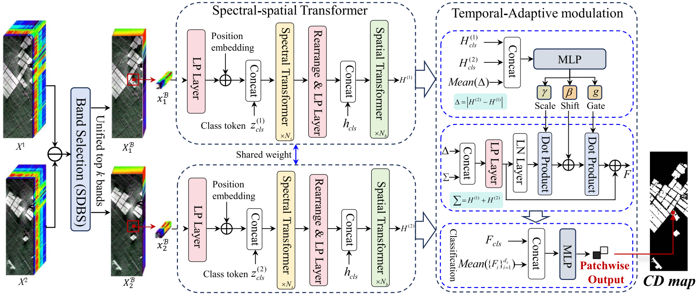

# B3STFormer
# Band-Selected Spectral-Spatial Transformer With Temporal Adaptive Modulation for Hyperspectral Image Change Detection
The code in this toolbox implements the ["Band-Selected Spectral-Spatial Transformer With Temporal Adaptive Modulation for Hyperspectral Image Change Detection"](https://ieeexplore.ieee.org/abstract/document/11668665). 



Citation
---------------------

**Please kindly cite the papers if this code is useful and helpful for your research.**

    @article{11668665,
      title={Band-Selected Spectral-Spatial Transformer With Temporal Adaptive Modulation for Hyperspectral Image Change Detection},
      author={Wang, Yanheng and Qin, Kai and Li, Zhuanfeng and He, Yingying and Yan, Shiyong and Sha, Jianjun},
      journal={IEEE Journal of Selected Topics in Applied Earth Observations and Remote Sensing},
      pages={29541-29553},
      year={2026},
      doi={10.1109/JSTARS.2026.3728255}
      volume={19}
    }
    
    
How to use it?
---------------------

## Requirements

```bash
pip install -r requirements.txt
```

The experiments were developed with Python 3.10 and PyTorch. A CUDA-enabled GPU is recommended.

## Dataset Layout

Set `--data-root` to the directory containing the HSI-CD datasets. The expected layout is:

```text
change_detection_data/
  China_change_detection/
    China_Change_Dataset.mat
  Barbara/
    barbara_2013.mat
    barbara_2014.mat
    barbara_gtChanges.mat
  river_dataset/
    river_before.mat
    river_after.mat
    groundtruth.mat
```

The loader also contains local support for BayArea and Farmland.

## Training and Testing

The training script trains the model for the specified number of epochs, saves the last-epoch checkpoint, and evaluates the test set once after training.

Main paper setting: patch size `P=5`, selected bands `K=64`, 500 changed and 500 unchanged training samples, SDBS band selection, and TAM fusion.

```bash
python run_experiments.py \
  --dataset China \
  --data-root /path/to/change_detection_data \
  --output-dir outputs/b3stformer \
  --epochs 200 \
  --train-number 500 \
  --max-test-points 0 \
  --patch-size 5 \
  --keep-bands 64 \
  --fixed-band-ranking diverse \
  --graph-neighbors 8 \
  --graph-weight 0.35
```

Run the same command with `--dataset Barbara` or `--dataset River` for the other datasets.

Licensing
---------

MIT License

Copyright (c) 2026 yanhengwang-heu

Permission is hereby granted, free of charge, to any person obtaining a copy
of this software and associated documentation files (the "Software"), to deal
in the Software without restriction, including without limitation the rights
to use, copy, modify, merge, publish, distribute, sublicense, and/or sell
copies of the Software, and to permit persons to whom the Software is
furnished to do so, subject to the following conditions:

The above copyright notice and this permission notice shall be included in all
copies or substantial portions of the Software.

THE SOFTWARE IS PROVIDED "AS IS", WITHOUT WARRANTY OF ANY KIND, EXPRESS OR
IMPLIED, INCLUDING BUT NOT LIMITED TO THE WARRANTIES OF MERCHANTABILITY,
FITNESS FOR A PARTICULAR PURPOSE AND NONINFRINGEMENT. IN NO EVENT SHALL THE
AUTHORS OR COPYRIGHT HOLDERS BE LIABLE FOR ANY CLAIM, DAMAGES OR OTHER
LIABILITY, WHETHER IN AN ACTION OF CONTRACT, TORT OR OTHERWISE, ARISING FROM,
OUT OF OR IN CONNECTION WITH THE SOFTWARE OR THE USE OR OTHER DEALINGS IN THE
SOFTWARE.
